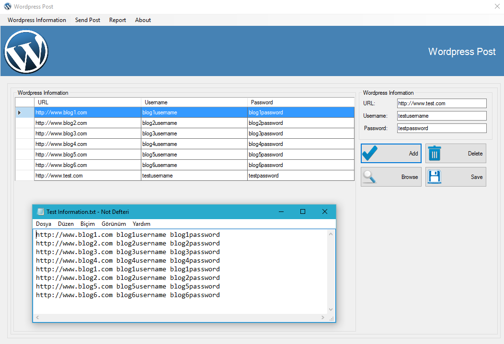
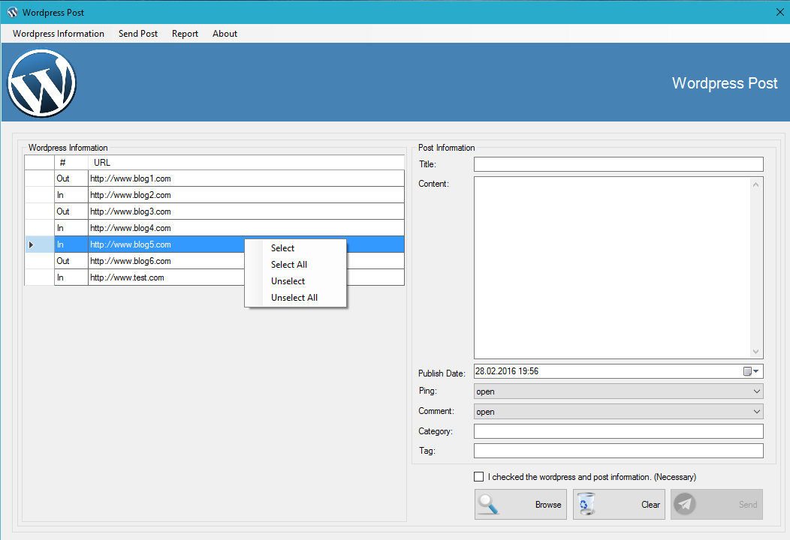
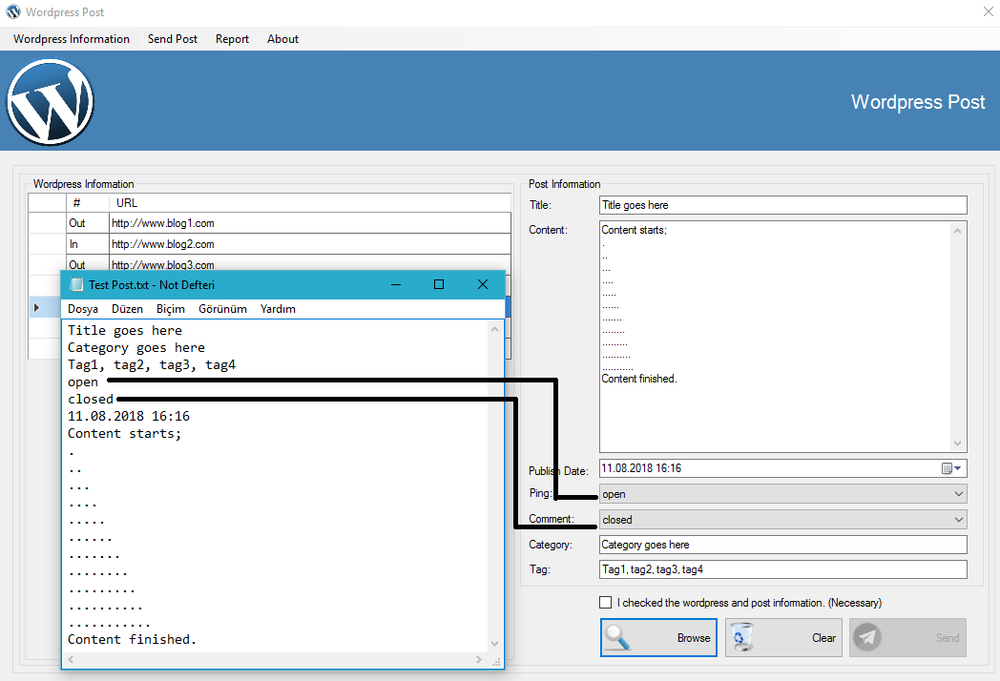
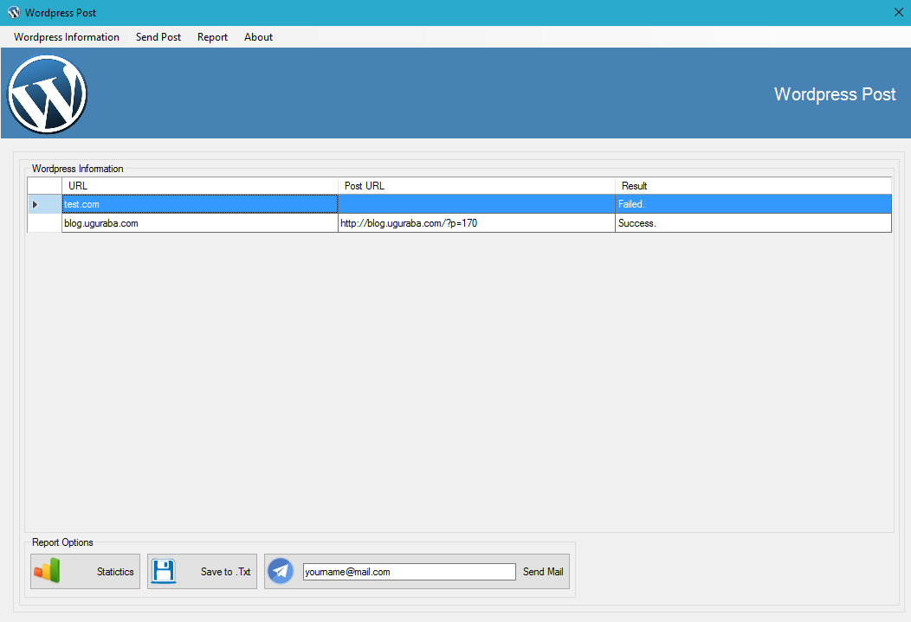
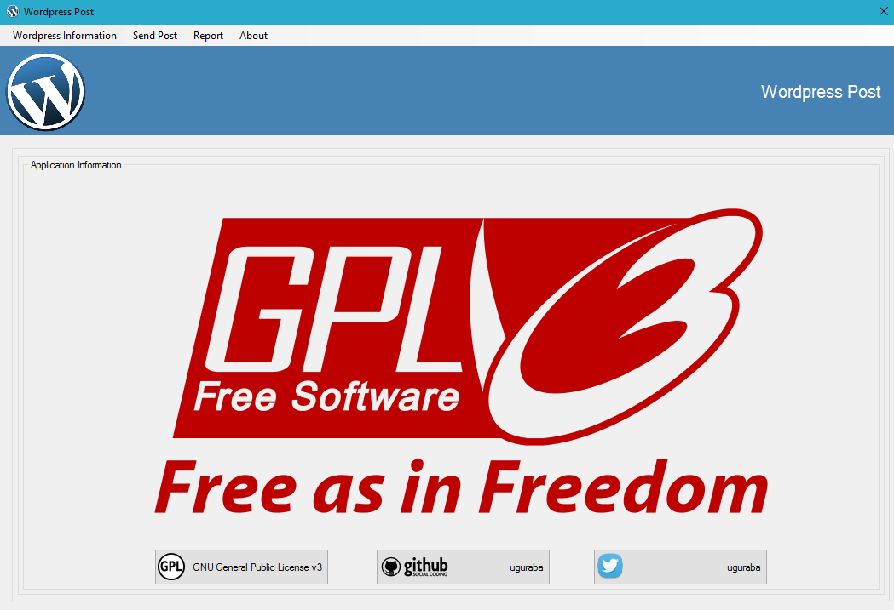

# C# Wordpress Post with GUI

# 0. Adding wordpress information

  User can add wordpress information (URL, Username, Password) manually also using with browse button user can select a text file and add to list. If there is a repetation on the text file, these lines are ignored.
  

# 1. Selecting wordpress

  In this section, user can select wordpress URL to send a post.

# 2. Getting post from a text file

  User can browse and select a text file, this text file has a structure. According this structure; 
  First line = Title 
  Second line = Category (Must be split with ',' character) 
  Third line = Tags (Must be split with ',' character) 
  Fourth line = Ping (This line must be 'open' or 'closed') 
  Fifth line = Comment (This line must be 'open' or 'closed') 
  Sixth line = Publish Date (If date is in the future, post will be automaticly scheduled to publish) 
  Seventh line = Content is starting from this line until the end of the file.

# 3. Report section

  In the report section, user can see the reports in each post. 
  User can see the basic statistics. 
  User can save the reports into a text file. 
  User can send the reports to a mail adress. (Default sender mail is csharpwordpresspost@gmail.com)

# 4. About section

# 5. Licence

GNU General Public Licence v3.0
http://www.gnu.org/licenses/gpl-3.0.en.html
